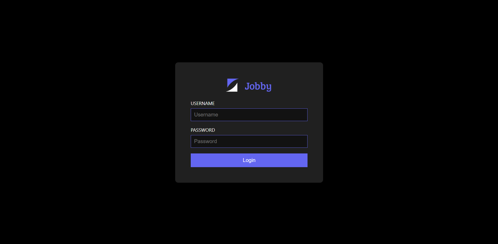
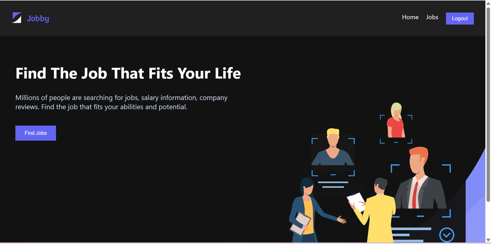
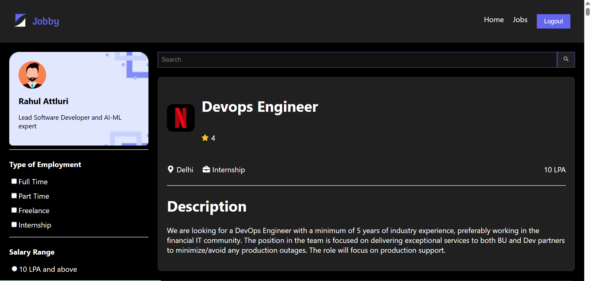
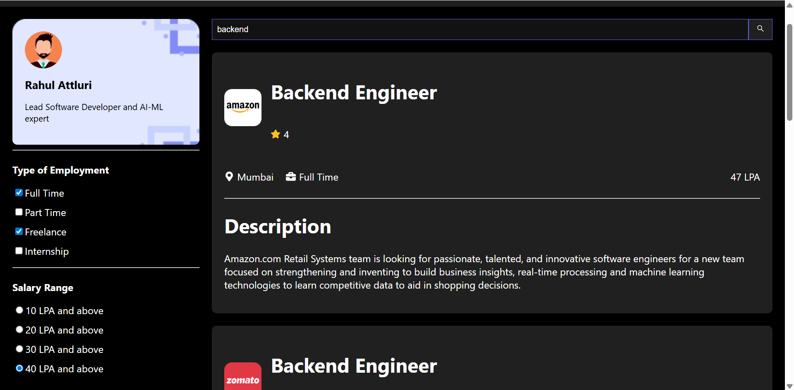
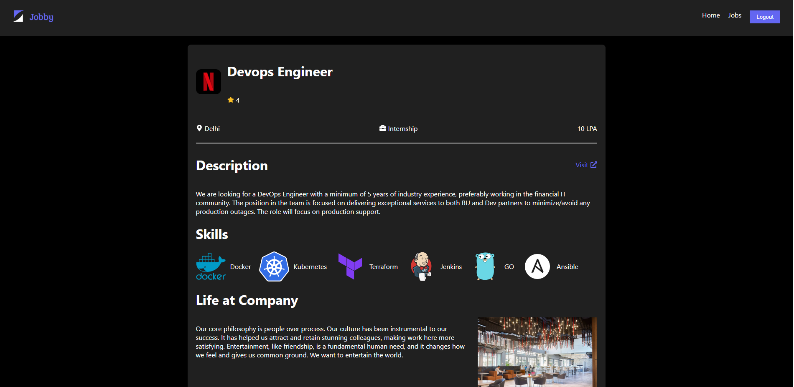
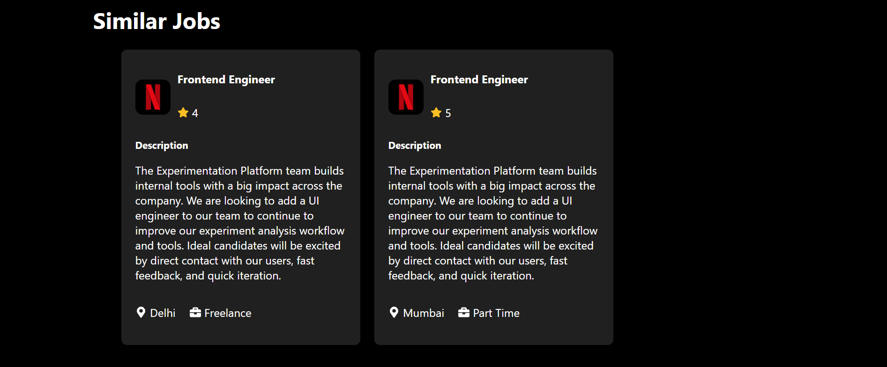

# CareerConnect Job Portal

CareerConnect is a **React-based job portal application** where users can explore job opportunities, view job details, and filter jobs based on employment type and salary range.

The application provides authentication, protected routes, and job search functionality to simulate a real-world job portal experience.

---

## Demo Credentials

Use the following credentials to log in:

Username: rahul
Password: rahul@2021

Note: The project uses predefined credentials because it integrates with a mock authentication API.

---

## Features

* User authentication (Login)
* Protected routes using custom `ProtectedRoute`
* Browse job listings
* View detailed job descriptions
* Filter jobs by employment type
* Filter jobs by salary range
* Similar jobs recommendations
* Profile section
* Responsive UI
* Logout functionality
* 404 Not Found page

---

## Tech Stack

Frontend

* React.js
* JavaScript (ES6+)
* CSS3

Libraries

* React Router
* js-cookie
* React Icons

Tools

* Git
* GitHub
* VS Code

---

## Project Structure

```
src
│
├── components
│   ├── Header
│   ├── Home
│   ├── JobCard
│   ├── JobItemDetails
│   ├── Jobs
│   ├── Login
│   ├── NotFound
│   ├── ProfileCard
│   ├── ProtectedRoute
│   └── SimilarJobCard
│
├── App.js
├── constants.js
├── index.js
└── index.css
```

---

## Installation

Clone the repository

```
git clone https://github.com/nagendra-programmer/careerconnect-job-portal.git
```

Navigate to project folder

```
cd careerconnect-job-portal
```

Install dependencies

```
npm install
```

Run the development server

```
npm start
```

Open in browser

```
http://localhost:3000
```

---

## Screenshots

### Login Page


### Home Page


### Jobs Page


### Jobs Page (Filters Applied)


### Job Details Page




---

## Future Improvements

* Add user registration feature
* Add backend authentication
* Implement job application feature
* Add saved jobs functionality
* Add recruiter dashboard

---

## Author

Nagendra

GitHub:
https://github.com/nagendra-programmer


