# CareerConnect Job Portal


## Live Demo

[View Live Application](https://careerconnect-job-portal.vercel.app)

---

CareerConnect is a full-stack job portal application where users can explore job opportunities, save jobs, and apply to them seamlessly.

Unlike traditional demo projects, this application uses custom-built backend APIs instead of third-party APIs, providing a real-world product experience.

It includes authentication, protected routes, dynamic job filtering, and complete job management features.

---

## 🚀 Key Highlights

- Full-stack application with custom backend APIs
- Real-world features like Save & Apply jobs
- Clean and responsive UI design
- End-to-end implementation (Frontend + Backend + Database)


## ✨ Features

* 🔐 User Authentication (Login & Register)
* 🛡 Protected Routes using custom `ProtectedRoute`
* 🔍 Search jobs by keyword
* 🎯 Filter jobs by employment type & salary range
* 💾 Save / Unsave jobs
* 📩 Apply to jobs
* 📄 View detailed job descriptions
* 📌 Applied Jobs tracking page
* 📚 Saved Jobs management
* 🔁 Retry mechanism for API failures
* 📊 Dynamic API integration (Custom Backend)
* 📱 Fully responsive UI
* 🚪 Logout functionality
* ❌ 404 Not Found page

---

## 🛠 Tech Stack

### 💻 Frontend
- React.js
- JavaScript (ES6+)
- CSS3(Flexbox & Responsive Design)

### ⚙ Backend
- Node.js
- Express.js

### 🗄 Database 
- MySQL

### 🔐 Authentication
- JWT (JSON Web Token)

### 📦 Libraries
- React Router
- js-cookie
- React Icons

### 🧰 Tools
- Git
- GitHub
- VS Code

---

## 📂 Project Structure

```
src
│
├── components
│   ├── Applied
│   ├── AppliedJobCard
│   ├── Header
│   ├── Home
│   ├── JobCard
│   ├── JobItemDetails
│   ├── Jobs
│   ├── Login
│   ├── Register
│   ├── RegistrationSuccess
│   ├── Saved
│   ├── SavedJobCard
│   ├── SimilarJobCard
│   ├── ProfileCard
│   ├── ProtectedRoute
│   └── NotFound
│
├── App.js
├── constants.js
├── index.js
└── index.css
```

---

## Installation

Clone the repository

```
git clone https://github.com/nagendra-programmer/careerconnect-job-portal.git
```

Navigate to project folder

```
cd careerconnect-job-portal
```

Install dependencies

```
npm install
```

Run the development server

```
npm start
```

Open in browser

```
http://localhost:3000
```

---

## 📸 Screenshots

### 📝 Registration Page
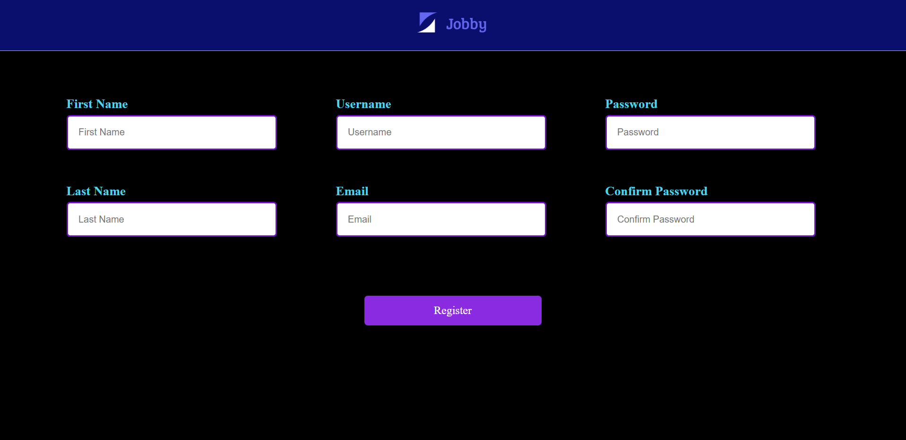

### ✅ Registration Success Page


### 🔐 Login Page
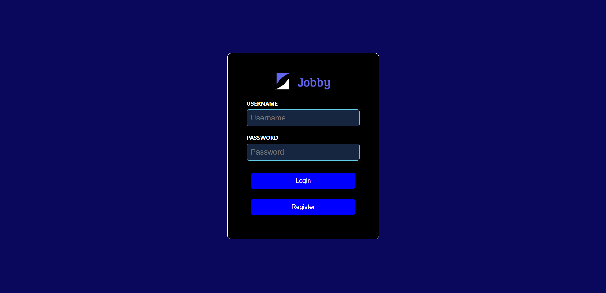

### 🏠 Home Page
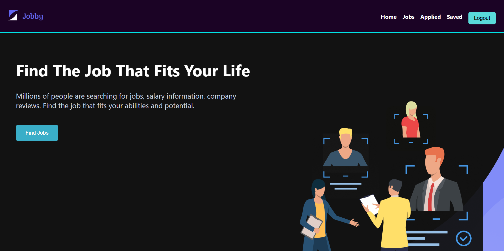

---

### 💼 Jobs Page
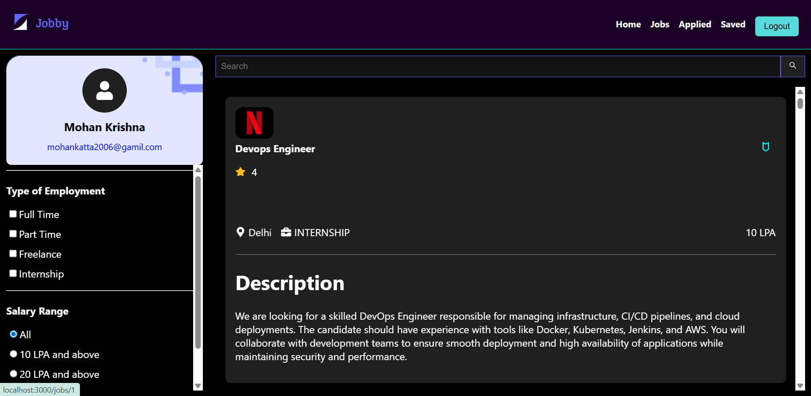

### 🎯 Jobs Page (Filters Applied)
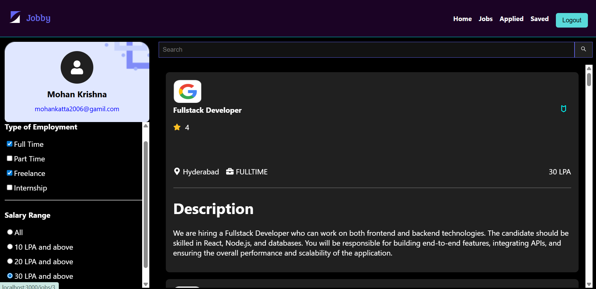

### 💾 Save Job


### ❌ Unsave Job
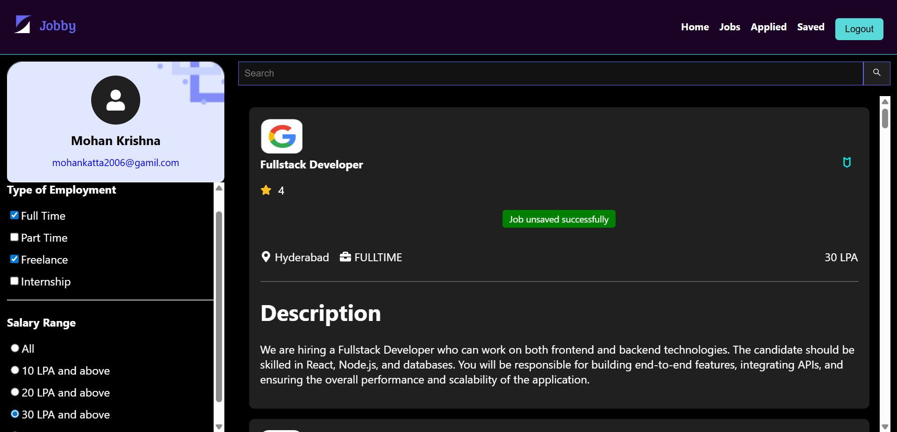

---

### 📄 Job Details Page
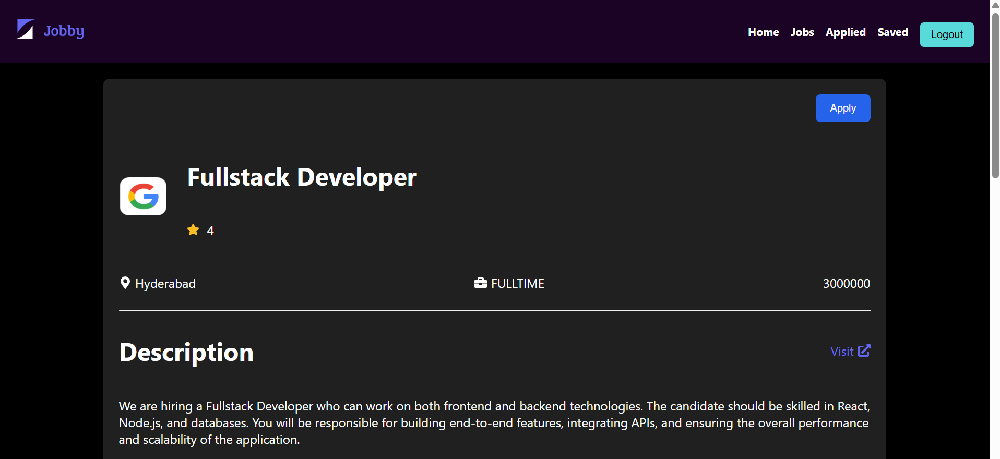
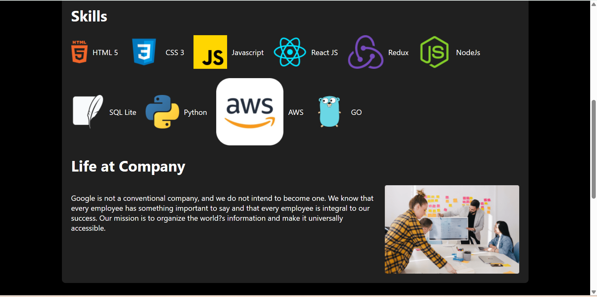

### 📩 Apply to Job
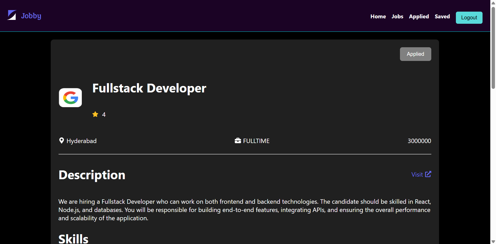

### 🔁 Similar Jobs
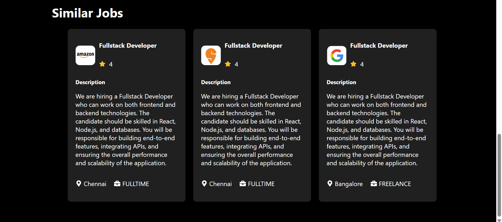

---

### 📚 Saved Jobs Page (Empty)
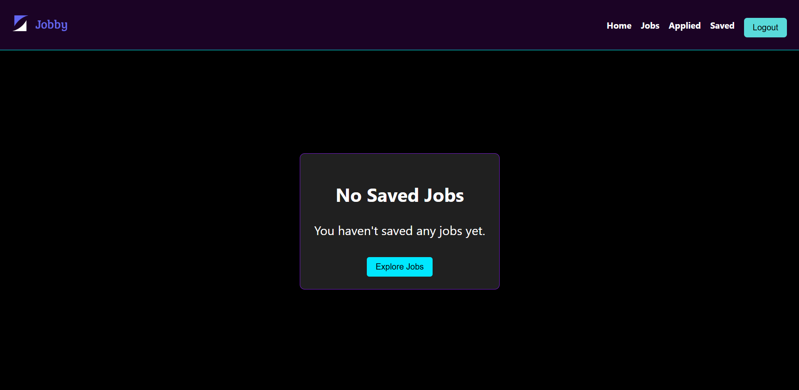

### 📚 Saved Jobs Page (With Jobs)
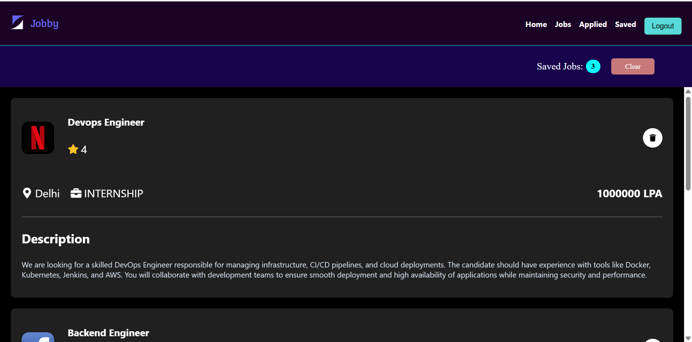

### 🧹 Clear Saved Jobs Popup
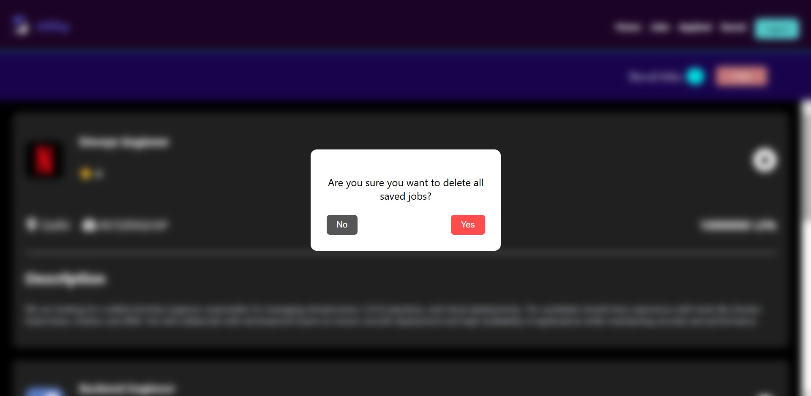

---

### 📌 Applied Jobs Page (Empty)
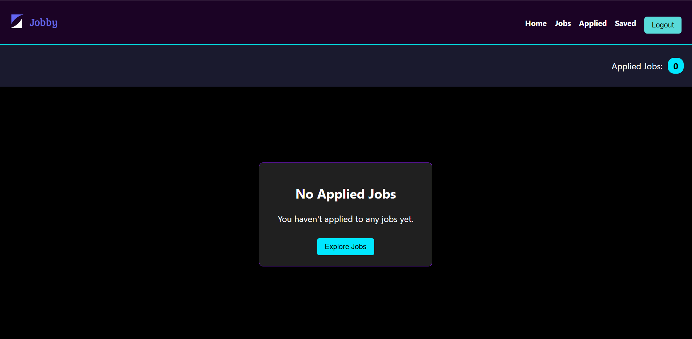

### 📌 Applied Jobs Page (With Jobs)
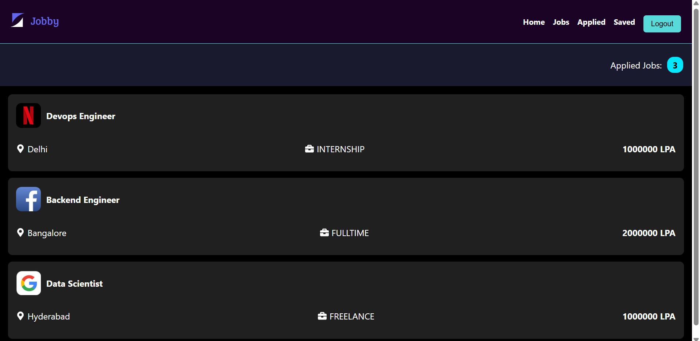

---

## Future Improvements

* 🔔 Job notifications system
* 🧑‍💼 Recruiter dashboard
* 📊 Analytics (applications tracking)
* 💬 Real-time chat with recruiters
* 🌐 Deploy backend with cloud database
* 🔎 Advanced search (skills, experience, company)
* 📄 Resume upload & profile builder
* ⭐ Company reviews & ratings system

---

## Author

**Nagendra Katta**

GitHub:  
https://github.com/nagendra-programmer


